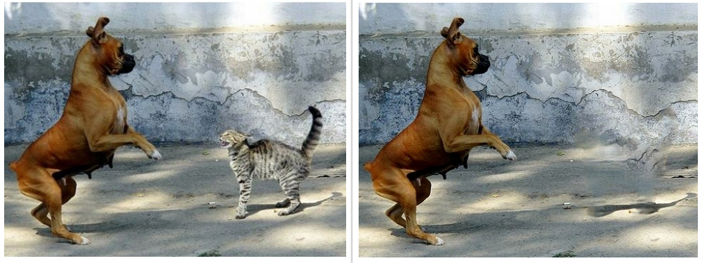
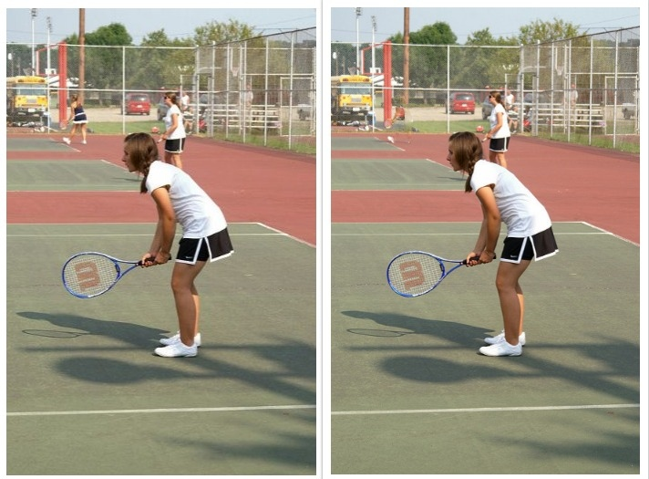
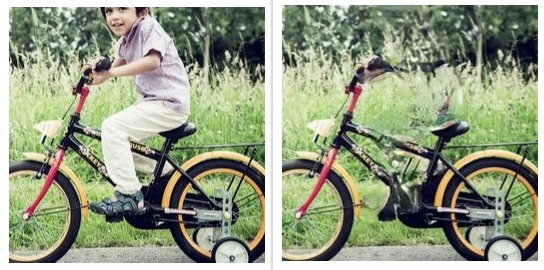

# Deep object remover

Remove an instance / class of choice from an image and fill out the background.

Final goal: remove object on-click.

## Examples





## Pipeline

This project doesn't provide a research contribution. It's simply a simplest merge of semantic segmentation + generative GAN to explore automatic object removal task. It constitutes of the following list of steps:

1. Per-instance semantic segmentation using [MaskRCNN](https://github.com/matterport/Mask_RCNN).

2. Obtain a mask that marks which pixels will be replaced with the inpainted background.

3. Use an original image and a mask from step 2 for image inpainting algorithm (original [implementation](https://github.com/JiahuiYu/generative_inpainting)).

The script that follows the pipeline is [samples/run.sh](https://github.com/kristijanbartol/deep-object-remover/blob/master/samples/run.sh).

## Usage

- build docker image using provided [Dockerfile](https://github.com/kristijanbartol/deep-object-remover/blob/master/Dockerfile):

```
nvidia-docker build -t keras-remover .
```

- run docker image:

```
docker run -it keras-remover bash
```

- \[TIP]: to reuse the container afterwards (to get the list of local containers type `docker container ls -a`):
```
docker start <container_name>
docker exec -it <container_name> bash
```

- generate segmentation masks ([masks.py](https://github.com/kristijanbartol/deep-object-remover/blob/master/samples/masks.py)):

```
# generate masks for random image from ./images/
python3 masks.py

# generate masks for specific image from ./images/
python3 masks.py <relative_path_to_image>
# for example
python3 masks.py ../images/1045023827_4ec3e8ba5c_z.jpg

# generate masks for all the image and all the segmented objects in them
python3 masks.py all
```

Generated masks are saved under ./images/results/masks/*.

- to run the whole procedure (segmentation -> masks + image inpainting):

```
./run.sh <relative_path_to_image> <class_name>
# for example
./run.sh ../images/1045023827_4ec3e8ba5c_z.jpg person
```

(For list of class in the image, check names of output images or program output).

## License

The project has non-commercial license as it is using [JiahuiYu](https://github.com/JiahuiYu)'s [generative inpainting](https://github.com/JiahuiYu/generative_inpainting) implementation that is published under non-commercial CC license.
